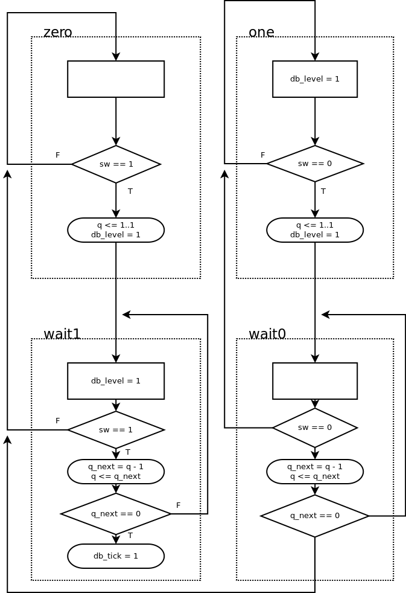

6.5.1 Alternative debouncing circuit
------------------------------------

### Page 170

#### Testing circuit operation

 - `btnL`: clear counter
 - `btnR`: increment counter
 - `btnD`: reset

The two 7-seg displays to the right display the counter with the debounced input, while 
the two to the left display the counter without a debouncing circuit.

#### ASMD chart of the alternative debouncing circuit

