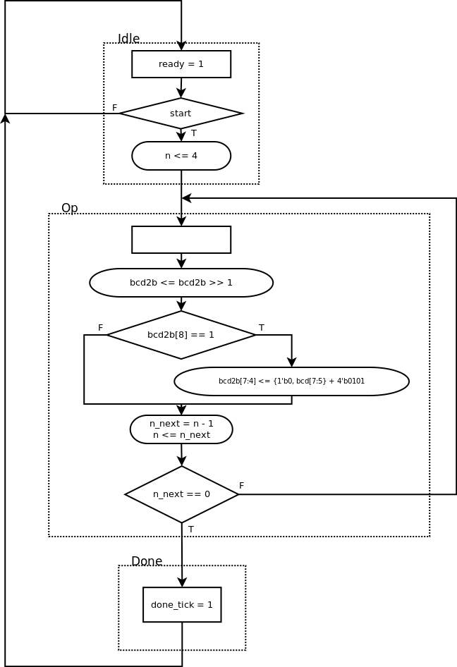

6.5.2 BCD-to-binary conversion circuit
--------------------------------------

### Page 171

#### Algorithm

The algorithm to get the binary value of a number in the BCD format is the inverse
of the one explained in Section 6.3.3.

We will start by copying the input BCD values in a special register. Then we will shift the
number left. If the lowest bit of BCD1 is 1, then we will need to adapt the content of
BCD0 (the inverse of a carry), either by adding 10 to it and then shifting the special register,
or by doing its equivalent, shifting and then adding 5. The latter is easier because we don't have
to think about the possible carry-bit.

After shifting everything from BCD1 (repeating the steps above 4 times), we are left with the 7-bit binary value on
the 7 lowest bits.

The table belows contains an example for the number 77 (`BCD1 = 4'b0111` and `BCD0 = 4'b0111`):

| **`bcd1`** | **`bcd0`** | **`bin`** | *Note*                                                        |
|:----------:|:----------:|:---------:|---------------------------------------------------------------|
|    0111    |    0111    |           | *`bcd1[0]` is 1, so shift and sum (next `bcd0` = 011 + 101)*  |
|     011    |    1000    |     1     | *`bcd1[0]` is 1, so shift and sum (next `bcd0` = 100 + 101)*  |
|     01     |    1001    |     01    | *`bcd1[0]` is 1, so shift and sum (next `bcd0` = 100 + 101)*  |
|      0     |    1001    |    101    | *`bcd1[0]` is 0, so just shift*                               |
|            |    0100    |    1101   | *Binary value in 7 lowest bits (`77 == 7'b100_1101)*          |

#### ASMD chart

