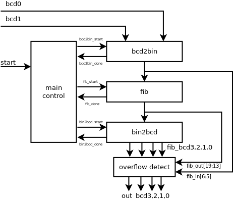

6.5.3 Fibonacci circuit with BCD I/O: design approach 1
-------------------------------------------------------

### Page 171

#### Testing circuit operation

 - `sw[3:0]`: bcd0
 - `sw[7:4]`: bcd1
 - `btnR`: start
 - `btnD`: reset

After pressing `btnR`, the Fibonacci number with the index of the selected input will
be displayed on the 7-seg LEDs. If the number is higher than 10000, then `9999` will be
displayed instead (overflow).

#### Top-level block diagram

#### Master control ASMD chart

