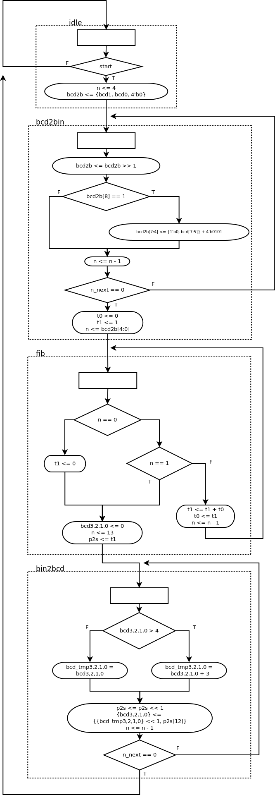

6.5.4 Fibonnaci circuit with BCD I/O: design approach 2
-------------------------------------------------------

### Page 171

#### Number of used cells comparison

According to the Synthesis Report, the second design approach uses roughly
6% less cells than the first approach.

First approach:
```
+------+-----------------+-------------+------+
|      |Instance         |Module       |Cells |
+------+-----------------+-------------+------+
|1     |top              |             |   406|
|2     |  bcd_fib_unit   |bcd_fib      |   253|
|3     |    bcd2bin_unit |bcd2bin      |    37|
|4     |    bin2bcd_unit |bin2bcd      |    81|
|5     |    fib_unit     |fib          |   131|
|6     |  db_unit        |debounce     |    82|
|7     |  dp_unit        |disp_hex_mux |    47|
+------+-----------------+-------------+------+
```

Second approach:
``` 
+------+---------------+-------------+------+
|      |Instance       |Module       |Cells |
+------+---------------+-------------+------+
|1     |top            |             |   382|
|2     |  bcd_fib_unit |bcd_fib      |   226|
|3     |  db_unit      |debounce     |    85|
|4     |  dp_unit      |disp_hex_mux |    47|
+------+---------------+-------------+------+
```

#### Number of clock cycles comparison

The second approach needs `4 + n + 14` clock cycles to complete the operation, being
`n` the input value. Each term of the sum represents one of the stages (`bcd2bin`, `fib`, `bin2bcd`).

The first approach needs one more clock cyle per stage because of the master FSM receiving the `done_ticks`
and issuing the `start` signals. So it needs `5 + (n+1) + 15` to complete the operation.

#### ASMD chart


