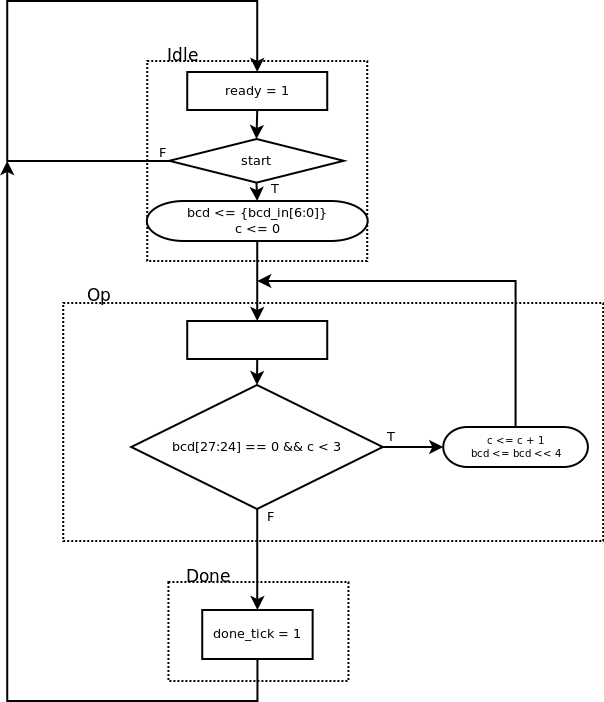

6.5.5 Auto-scaled low-frequency counter
---------------------------------------

### Page 171

#### Modifications

* The period counter now counts the period in microseconds up to 1 second (20-bit output).
* The division circuit now divides `1_000_000_000` (30-bits) by the period in microseconds (20-bit), to get the frequency times 1000 as the output (to represent the 3 decimal places).
* The binary-to-BCD circuit got extended from 13-bit binary input and 4 BCD output to
25-bit binary input and 7 BCD output.
* A BCD adjustment circuit was added to shift the digits to the left when the most
significant one is zero and indicate where the decimal point will be.
* A simple decoder on the top level circuit translates the decimal point counter
of the adjustment circuit to for the seven-segment display circuit.

#### Testing circuit operation

The testing circuit works the same way as for the *6.3.4* and *6.3.5* circuits.

The period of the input signal is set according to the switches `sw[2:0]`.

Then, press `btnL` to display the frequency.

| `sw[2:0]` | period (*ms*) | frequency (*Hz*) |
|:---------:|:-------------:|:----------------:|
|   3'b000  |     0.11      |     9090.90      |
|   3'b001  |      0.2      |        5000      |
|   3'b010  |        1      |        1000      |
|   3'b011  |        3      |     333.333      |
|   3'b100  |       60      |      16.666      |
|   3'b101  |      170      |       5.882      |
|   3'b110  |      760      |       1.315      |
|   3'b111  |     1000      |       1.000      |

#### AMSD chart of the BCD adjustment circuit

