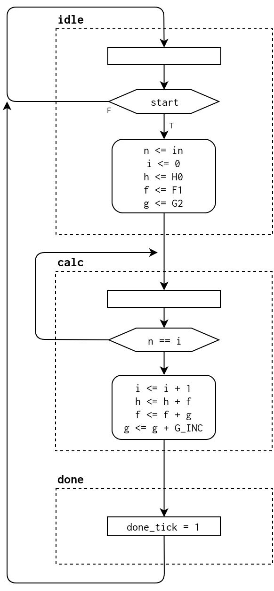

6.5.6 Babbage difference engine emulation circuit
-------------------------------------------------

### Page 173

### Babbage Difference Engine Emulator Circuit

#### Three-order polynomial equations

These are the recursive equations for `h(n) = n^3 + 2n^2 + 2n + 1`:

```
h(n) 
    = 1            , n = 0
    = h(n-1) + f(n), n > 0

f(n)
    = 5            , n = 1
    = f(n-1) + g(n), n > 1

g(n)
    = 10           , n = 2
    = g(n-1) + 6   , n > 2
```

#### Testing circuit operation

- `sw[15]`: Selects between `f(n)` (0) or `h(n)` (1)
- `sw[5:0]`: Input value `n`
- `btnC`: Start
- `btnD`: Reset

The result of the calculation will be displayed on the 7-seg display.
Garbage will be displayed for any value of `n > 20` for `h(n)`.

#### Babbage engine emulation circuit ASMD chart


