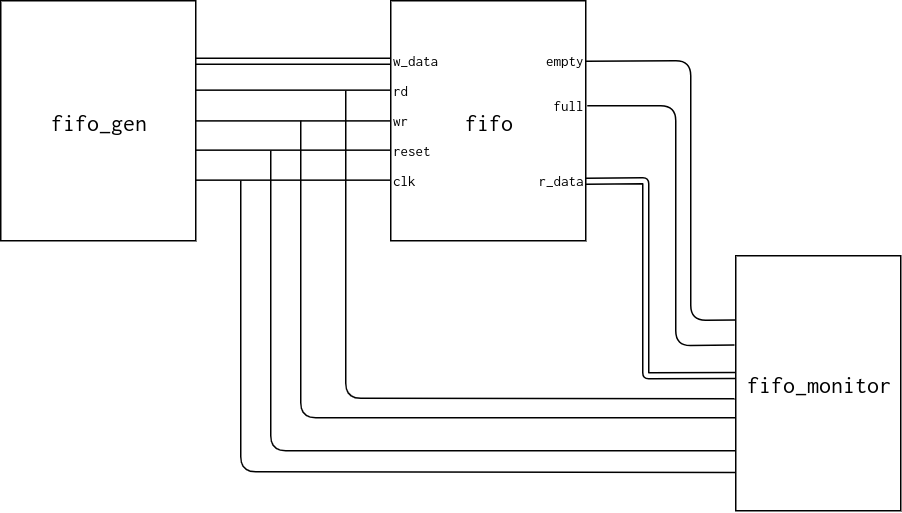

7.7.7 Testbench for FIFO buffer
-------------------------------

### Page 212

#### Testbench diagram



#### Output example

```
time  clk  reset  rd    wr  w_data  r_data  empty  full
    0,  1    x    0     0      0       x      x     x          
   20,  1    0    0     0      0       x      1     0          
   40,  1    0    0     1      4       x      1     0          
   60,  1    0    0     0      4       4      0     0          
   80,  1    0    0     1      3       4      0     0          
  100,  1    0    0     0      3       4      0     0          
  120,  1    0    0     1      2       4      0     0          
  140,  1    0    0     0      2       4      0     0          
  160,  1    0    0     1      1       4      0     0          
  180,  1    0    0     0      1       4      0     1          
  200,  1    0    0     1      0       4      0     1          
  220,  1    0    0     0      0       4      0     1          
  240,  1    0    1     0      0       4      0     1          
  260,  1    0    0     0      0       3      0     0          
  280,  1    0    1     0      0       3      0     0          
  300,  1    0    0     0      0       2      0     0          
  320,  1    0    1     0      0       2      0     0          
  340,  1    0    0     0      0       1      0     0          
  360,  1    0    1     0      0       1      0     0          
  380,  1    0    0     0      0       4      1     0          
  400,  1    0    1     0      0       4      1     0          
  420,  1    0    0     0      0       4      1     0          
  440,  1    0    0     1      7       4      1     0          
  460,  1    0    0     0      7       7      0     0          
  480,  1    0    1     1      3       7      0     0          
  500,  1    0    0     0      3       3      0     0          
  520,  1    0    1     0      3       3      0     0       
```
